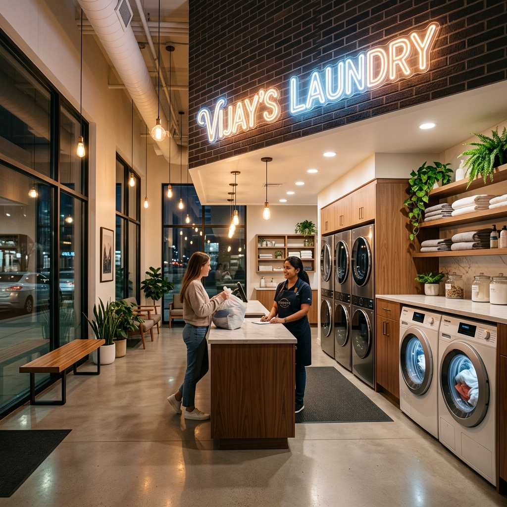
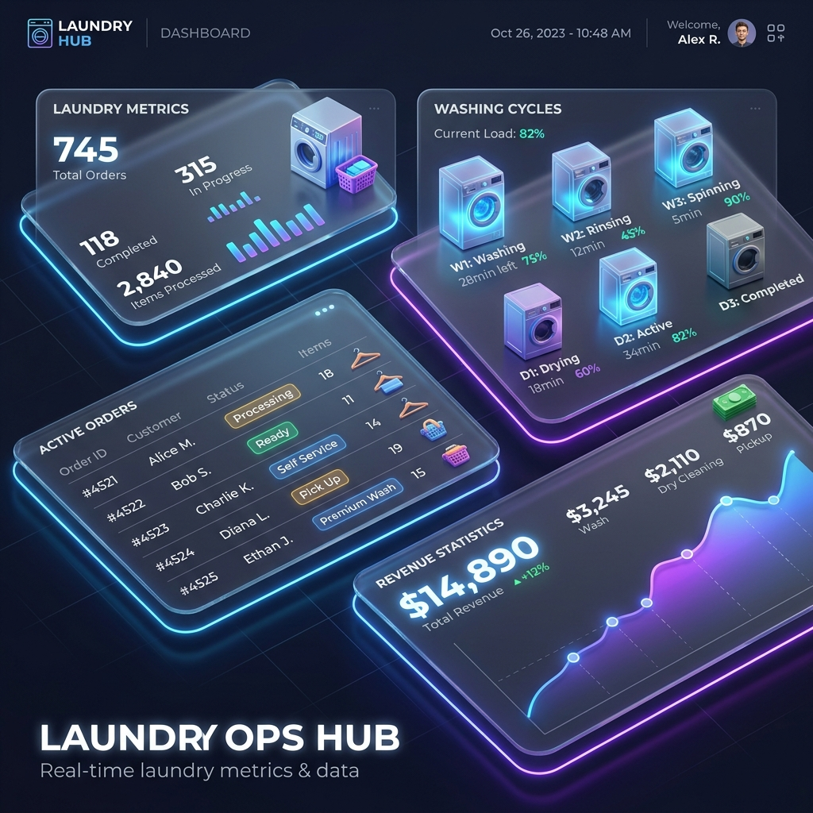

# 🧺 Vijay's Laundry Management System

A premium, modern, and highly efficient PHP-based web application designed to streamline laundry shop operations. From tracking customer order priorities and laundry weights to managing service types and generating comprehensive sales reports, this application provides an intuitive dashboard for seamless management.



---

## 🚀 Key Features

### 📋 Laundry & Order Management
* **Priority Tracking**: Categorize orders based on urgency levels to ensure timely delivery.
* **Smart Weight Calculation**: Calculate costs automatically based on weight and service type rates.
* **Order Claims**: Mark orders as claimed and update client status instantly.

### 💼 Admin Tools & Sales Reports
* **Dashboard Overview**: Monitor active laundry requests, prices, and status.
* **Sales Reports**: Generate detailed transaction reports for specific dates or view overall business stats.
* **Custom Service Rates**: Add, modify, and delete laundry types (e.g., Blanket, Clothes) and set custom pricing.



---

## 🛠️ Technology Stack

The application is built using lightweight, highly responsive frontend and backend technologies:

* **Backend**: [PHP](file:///d:/BACKUP/projects/PHP project/laundry/index.php) (Vanilla PDO Database Wrapper)
* **Database**: [MySQL](file:///d:/BACKUP/projects/PHP project/laundry/laundry.sql)
* **Frontend**: JavaScript, jQuery, Ajax, Bootstrap 3, and CSS3
* **Admin Template**: AdminLTE Theme for a sleek dashboard experience


---

## 📂 Project Directory Structure

```text
├── assets/                  # CSS, JS, and Fonts
│   └── images/              # Premium 3D Illustrations
├── class/                   # PHP OOP Classes
│   ├── Laundry.php          # Handles laundry order logic
│   ├── Sales.php            # Handles sales reporting logic
│   └── User.php             # Handles admin authentication logic
├── data/                    # AJAX data processing scripts
├── database/                # Database connection configuration
│   ├── Connection.php       # PDO Connection Setup
│   └── Database.php         # Base Database Wrapper Class
├── interface/               # PHP OOP Interfaces
├── modal/                   # Reusable Bootstrap Modals (password reset, confirmations)
├── laundry.sql              # MySQL Database Schema and Seed Data
├── index.php                # Admin Login Page
└── home.php                 # Admin Dashboard Landing Page
```

---

## ⚙️ Installation & Setup

Follow these steps to set up and run the project locally:

### 1. Prerequisites
Ensure you have a local server environment installed (such as **XAMPP**, **WAMP**, or **Laragon**) containing **PHP (v7.0+)** and **MySQL**.

### 2. Database Import
1. Open **phpMyAdmin** or your preferred database client.
2. Create a new database named `laundry`.
3. Import the [laundry.sql](file:///d:/BACKUP/projects/PHP project/laundry/laundry.sql) file into the newly created database.

### 3. Database Connection Configuration
By default, the database configuration uses standard XAMPP credentials:
* **Host**: `localhost`
* **Username**: `root`
* **Password**: `""` (empty)
* **Database Name**: `laundry`

If you need to customize these connection settings, edit the arguments inside [database/Connection.php](file:///d:/BACKUP/projects/PHP project/laundry/database/Connection.php#L9).

### 4. Running the Application
1. Place the project folder into your server's root directory (e.g., `C:/xampp/htdocs/laundry`).
2. Start the Apache and MySQL services.
3. Open your browser and navigate to: `http://localhost/laundry/`

### 5. Default Credentials
Use the default administrator credentials to log in:
* **Username**: `admin`
* **Password**: `admin`

---

## 📄 License & Attribution
Developed and maintained by **[Vijay Mahes](https://github.com/vijaymahes9080)**. Feel free to fork, customize, and extend its functionalities!
